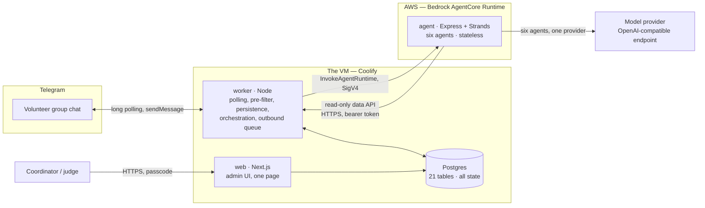
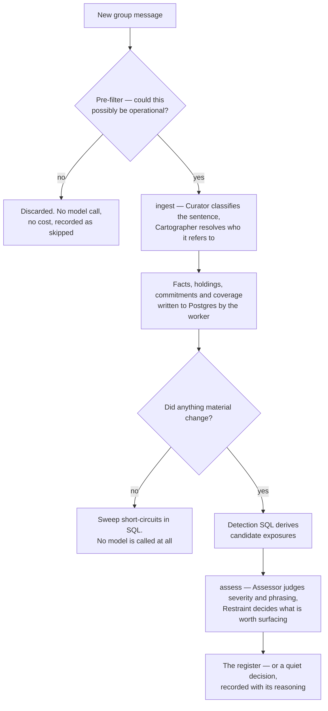

# Architecture

Baton is three processes and one database. This document explains what each one does, why the work is
split the way it is, and where the model is — and deliberately is not.

If you read only one thing: **the worker owns all state and is the only writer; the agent owns all
judgment and holds no credentials.** Everything below follows from that.

---

## The shape

## The four components

| Component                                   | Responsibility                                                                                                                                                                               | What it cannot do                                                                               |
| ------------------------------------------- | -------------------------------------------------------------------------------------------------------------------------------------------------------------------------------------------- | ----------------------------------------------------------------------------------------------- |
| **Postgres**                                | Every fact, holding, commitment, finding, question, brief and run. 21 tables. Reached over the Docker network only, never published to a host port.                                          | —                                                                                               |
| **worker** (Node)                           | Telegram long polling, the deterministic pre-filter, **all** persistence, orchestrating agent calls, the outbound message queue, the periodic sweep, and a read-only data API for the agent. | Make a judgment. It counts and queries; it never decides what is worth saying.                  |
| **agent** (Express + Strands, on AgentCore) | Every judgment: what a sentence means, whether a claim is stale, how severe an exposure is, and what is not worth raising.                                                                   | Touch the database. It holds no credentials, and writes nothing. It returns _proposed_ changes. |
| **web** (Next.js)                           | The admin UI — one page, four sections, behind a passcode. Read-mostly.                                                                                                                      | Poll Telegram or call the agent.                                                                |

**Telegram is reached by long polling, not webhooks.** The VM is always on, so `getUpdates` removes the
need for a public endpoint for the bot, works behind NAT, and needs no re-registration after a restart.

## The one rule behind the split

**AWS holds stateless compute and nothing else. The VM holds everything stateful.**

That single rule removes most of the infrastructure a system like this usually needs. Because Postgres
is never reachable from AWS, there is no VPC, no RDS, no load balancer and no Secrets Manager. Because
the agent container holds no database credentials, a compromised or misbehaving agent cannot corrupt the
register — the worst it can do is propose something the worker declines to write.

The two sides therefore share no secret. The model API key never touches the VM; the database URL never
reaches AWS.

The agent's no-credentials property is enforced rather than trusted: the repository's ESLint
configuration fails the build on any import of `pg`, `postgres`, `drizzle-orm` or `@baton/core/db` from
inside `apps/agent`.

## How a message becomes a fact

Two details in that path are worth stating plainly, because they are where the cost and the credibility
live.

**The pre-filter is deterministic and runs before any model.** Most of a group chat is "ok thanks" and
"see you there". Sending that to a model would cost money to be told it means nothing, so a cheap rule
set discards it first, and every discard is recorded so the UI can show what was skipped rather than
silently dropping it.

**An idle system calls no model.** The sweep compares the candidate set against the previous run's
fingerprint in SQL. If nothing changed, the run ends before any invocation. A sweep that asks a model
"has anything changed?" has already paid for the answer.

## The five tasks

The agent container exposes AgentCore's standard `POST /invocations` and dispatches on a `task` field.

| Task      | Composition                                  | Triggered by                                 |
| --------- | -------------------------------------------- | -------------------------------------------- |
| `ingest`  | Strands `Graph`: Curator → Cartographer      | A batch of candidate messages                |
| `assess`  | Strands `Graph`: Assessor → Restraint (hook) | The periodic sweep, or a material change     |
| `brief`   | Briefer, Restraint hooked on produce         | A Telegram join or leave                     |
| `respond` | Respondent, Restraint hooked on produce      | An operational question in the group         |
| `resume`  | Any of the above, restored from a snapshot   | An approval or clarification answer arriving |

Six agents in total: **Curator** (what does this sentence mean), **Cartographer** (who does it refer
to), **Assessor** (how serious is this exposure), **Restraint** (is this worth saying at all),
**Briefer** (write the handover), **Respondent** (answer the group).

`Graph` rather than `Swarm` because the pipeline order is fixed and agents must not choose their own
routing. Restraint attaches as a hook on the three tasks that produce text a human reads; `ingest`
produces no outbound text and is the one task it does not touch.

**The agent has tools, and they are all read-only** — `searchFacts`, `getEvidence`, `getHoldings`,
`getPerson`, called over the worker's token-authenticated data API. Predictable context is hydrated into
the request payload; tools exist for the lookups an agent cannot know it needs in advance, chiefly
drilling into evidence. Tool calls appear in the trace, which is what the activity panel renders.

## Where the model is not

Three deliberate absences. Each one is a place where using the model would have been the obvious choice
and the wrong one.

**Detection is SQL.** Every candidate exposure is a plain query — five queries producing four finding
types:

| Finding                    | Query                                                          |
| -------------------------- | -------------------------------------------------------------- |
| `sole_holder`              | `holdings` grouped by asset, having exactly one active holder  |
| `sole_holder` (capability) | `capability_coverage` grouped by capability, having one person |
| `no_owner`                 | An active asset with no active holding                         |
| `not_ours`                 | An active holding flagged as a personal resource               |
| `loose_end`                | An open commitment past its threshold                          |

Asking a model to count would be slower, more expensive and less reliable than `GROUP BY`. The model
receives the candidates and does the part that needs judgment: severity, phrasing, aggregation, and
whether the evidence is too thin to raise.

Every one of those queries filters to `status = 'active'`, which is how the promise that a pending or
unverified claim never appears in a finding is kept in SQL rather than in prompt text.

**There is no vector store.** The organisation has on the order of a couple of hundred facts. The whole
index — claim, id, holder, last-confirmed date — is a few thousand tokens and is passed as context.
Embeddings over two hundred rows would be ceremony, and would add a way for the right fact to be absent
from a request.

**The model never writes.** It returns proposed changes; the worker validates them against a schema and
decides. Every agent response is checked against its Zod schema, and a malformed response is retried
with the validation error fed back.

## The approval gate

The one flow with real mechanical complexity, and the reason the system needs snapshots at all.

When Baton is about to record something consequential — who controls the bank account, who holds the
keys — and its own confidence is weak, it does not guess and it does not silently drop the claim. It
asks, and waits, possibly for hours.

1. A node raises an interrupt, or the worker's own consequence gate classifies the claim as
   high-consequence and weakly evidenced.
2. The worker writes a `questions` row and a `pending_changes` row, and stores the agent's serialised
   snapshot in `agent_sessions`.
3. It asks — in the group, or privately to the coordinator when the asset is sensitive. An approval
   about who controls the money, asked in front of twenty people, hands the group the authority the gate
   exists to withhold.
4. The reply arrives later. The worker matches it to the open question, checks that the answerer is
   permitted, and resumes the agent from the snapshot with the answer attached.

While a change is pending it is invisible everywhere — excluded from detection, from the fact index the
Respondent sees, and from the brief. It is never adopted on a timeout and never discarded.

A volunteer answering an approval changes nothing: only the coordinator can approve. Verification and
clarification questions, by contrast, accept an answer from anyone in the group — those are questions of
fact, and the group is the authority on its own facts.

## What the schema refuses to hold

Baton tracks **what the organisation knows, not what its people do.**

There is no attendance table. There is no per-person score, completion rate, reliability figure or
activity metric anywhere in the 21 tables. A volunteer group runs on goodwill, and a tool that quietly
ranked its members would be worse than no tool.

This is enforced structurally rather than promised: a test introspects the live Drizzle table objects
and fails if any table or column name contains a scoring, ranking or attendance term. It inspects the
objects rather than grepping the source, because the source necessarily contains the words it forbids —
in the comment explaining the rule. The assertion is vacuous today and becomes load-bearing the moment
someone adds such a column, with nobody having to remember to check.

Two related guarantees, kept the same way: credentials are redacted on the server before a quoted
message ever crosses to the browser, and a claim's provenance can be withdrawn — the quote stops being
shown and stops travelling — without deleting the fact, because deleting it would be the larger lie.

## Deployment

| Where                 | What                                                             | Why there                                                     |
| --------------------- | ---------------------------------------------------------------- | ------------------------------------------------------------- |
| Coolify on a VM       | Postgres, worker, web, and the Traefik proxy that terminates TLS | All state in one place, with `docker exec` access for backups |
| AWS AgentCore Runtime | The agent container, built by CodeBuild and pulled from ECR      | Stateless compute, redeployable with nothing to drain         |

Two constraints that are not obvious and are load-bearing:

**Postgres, worker and web deploy as a single Coolify Docker Compose resource, not as three Application
resources.** Coolify applies rolling updates to Application resources — the replacement container starts
before the old one stops. Two worker containers running at once means two `getUpdates` consumers on one
bot token, splitting the update stream: the bot would answer some messages and silently drop others,
with nothing in either log looking wrong. Compose deployments are not rolled, so this gives
stop-then-start semantics for free.

**A change to the shared schema package deploys agent first, then worker.** The request envelope is the
contract between them and they deploy independently, so a shape change opens a window where one
validates against the other's old schema. The worker has exponential backoff and its outbound queue
retains its work, so a few seconds of failed calls cost nothing — whereas deploying the worker first
means it sends a shape the agent rejects.

Migrations run automatically, from the shared package, on worker start.

## Repository map

| Path              | Contents                                                                                                 |
| ----------------- | -------------------------------------------------------------------------------------------------------- |
| `packages/core`   | The contract between the three apps: Drizzle schema, Zod schemas, prompts, normalisation, the pre-filter |
| `apps/worker`     | Polling, persistence, detection SQL, orchestration, approvals, the data API                              |
| `apps/agent`      | The AgentCore container: six agents, five tasks, structured output, tools                                |
| `apps/web`        | The admin UI                                                                                             |
| `scripts`         | Seed generation and backfill of the demo history                                                         |
| `docs/RUNBOOK.md` | How to run it locally, and how to deploy it                                                              |

The seeded demo history deserves a word, because a judge will reasonably ask where six months of
messages came from. They are **generated**, not borrowed: a committed plan fixture defines the roster,
the calendar and every planted case, and a renderer turns it into prose. No real group's chat was used.
That matters more than convenience — a privacy claim would be hollow if the demo data were somebody's
actual messages. After rendering, the generator re-scans its own output and exits non-zero if any
required path is missing, so a transcript that would silently fail to exercise the pipeline never
reaches the database.

## Current state

Honest, because the alternative is a judge discovering it and trusting nothing else here:

- **Built and tested:** the shared package, the database schema, all six agents, and the worker's
  intake, derivation, detection, orchestration and approval halves. The suites run against live
  Postgres.
- **Proved end to end at the model boundary:** a live call reaches the provider through Strands on the
  same code path the container uses.
- **Not yet run:** curation — turning the loaded messages into facts. The intake half of the demo
  history is in Postgres; the register it produces is the next step rather than a blocked one.
- **Still a seam:** the admin UI reads generated fixtures rather than Postgres, and its write actions
  do not persist. The read and write seams are each a single file, deliberately, so the swap is
  contained.

For the full inventory, item by item with its evidence, see
`docs/superpowers/specs/2026-09-13-baton-implementation-checklist.md`. The reasoning behind every
decision above is in `docs/superpowers/specs/2026-09-12-baton-technical-design.md`, and the product
argument is in `docs/superpowers/specs/2026-09-12-baton-design.md`.
